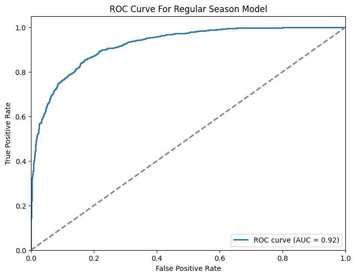
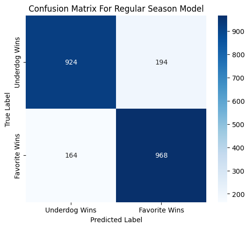
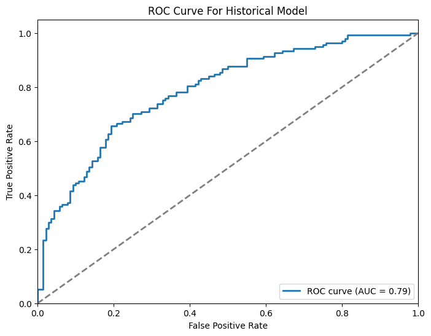
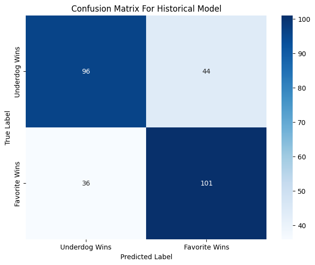

# 🏀 NCAA Men's March Madness Game Outcome Prediction 

This project aims to predict the outcomes of NCAA basketball tournament games (March Madness) by blending predictions from two distinct machine learning models:

- **Regular Season Model:** Trained on detailed regular-season game data from the 2024-2025 seasons.
- **Historical Model:** Trained on historical NCAA tournament data dating back to 2003.

By giving more weight to recent performance (Regular Season Model) over historical tournament performance (Historical Model), the blended prediction leverages both long-term historical trends and short-term current form insights, acknowledging the higher predictive power of recent performance entering the tournament.

---

## 📌 Overview of the Approach

### 1. **Regular Season Model**
This model emphasizes the recent form and performance trends of teams during the 2024-2025 regular season, utilizing metrics that reflect immediate team performance leading into the tournament.

### 2. **Historical Model**
This model relies on long-term historical performance indicators, capturing a team's consistency, experience, and historical success patterns in NCAA tournaments since 2003.

---

## 📥 Data Source
The data used for this project was obtained from the **March Machine Learning Mania 2025** competition on Kaggle:
[March Machine Learning Mania 2025](https://www.kaggle.com/competitions/march-machine-learning-mania-2025)

---

## 🎯 Tournament Predictions & Model Evaluation

The following table presents our blended model predictions for each game in the tournament. As games conclude, we will update the **Correct Prediction?** column to track accuracy.

### 📌 What is **Blended Pred**?
The **Blended Prediction** represents the estimated probability that the **Lower Seed Wins**. It is derived from two different models:
1. **Regular Season Model (2024-2025):** Focuses on the latest form and performance metrics.
2. **Historical Model (2003-Present):** Considers long-term team strength and tournament experience.

Since current form is a stronger predictor of tournament performance, we assigned more weight to the **Regular Season Model** when blending predictions.

### 📌 Target Variable
The target variable in the model is **whether the lower-seeded team wins the game (1) or loses (0)**.  
- **Blended Prediction > 0.50** → The model predicts the **Lower Seed Wins**  
- **Blended Prediction < 0.50** → The model predicts the **Higher Seed Wins**  

### 📌 Prediction Rules:
- If **Blended Prediction** > 0.50 → **Favor Lower Seed**
- If **Blended Prediction** < 0.50 → **Favor Higher Seed**
- If **Blended Prediction** is between **0.45 and 0.50**, we favor the **Lower Seed** as the matchup is too close to call.

---

### 📊 Round 1: Prediction Table:

| Region  | Lower Team        | Higher Team     | Reg. Season Pred | Hist. Pred | Blended Pred | Final Prediction | Correct Prediction? |
|---------|------------------|-----------------|------------------|------------|--------------|------------------|---------------------|
| South   | Auburn           | Alabama St      | 0.353            | 0.651      | 0.457        | **Auburn**        | ✅                  |
| South   | Louisville       | Creighton       | 0.473            | 0.469      | 0.472        | **Louisville**    | ❌                  |
| South   | Texas A&M        | Yale            | 0.611            | 0.552      | 0.590        | **Texas A&M**     | ✅                  |
| South   | Mississippi      | North Carolina  | 0.363            | 0.282      | 0.337        | **North Carolina**| ❓                  |
| South   | Iowa St          | Lipscomb        | 0.247            | 0.286      | 0.261        | **Lipscomb**      | ❓                  |
| South   | Marquette        | New Mexico      | 0.846            | 0.616      | 0.766        | **Marquette**     | ❓                  |
| South   | Michigan St      | Bryant          | 0.208            | 0.275      | 0.231        | **Bryant**        | ❓                  |
| East    | Duke             | Mt St Mary's    | 0.930            | 0.382      | 0.738        | **Duke**          | ❓                  |
| East    | Mississippi St   | Baylor          | 0.302            | 0.172      | 0.256        | **Baylor**        | ✅                  |
| East    | Oregon           | Liberty         | 0.579            | 0.532      | 0.563        | **Oregon**        | ❓                  |
| East    | Arizona          | Akron           | 0.583            | 0.631      | 0.606        | **Arizona**       | ❓                  |
| East    | BYU              | VCU             | 0.432            | 0.637      | 0.504        | **BYU**           | ✅                  |
| East    | Wisconsin        | Montana         | 0.010            | 0.224      | 0.085        | **Wisconsin**     | ✅                  |
| East    | St Mary's CA     | Vanderbilt      | 0.485            | 0.728      | 0.570        | **St Mary's CA**  | ❓                  |
| East    | Alabama          | Robert Morris   | 0.920            | 0.643      | 0.823        | **Alabama**       | ✅                  |
| Midwest | Houston          | SIUE            | 0.79             |            | 0.79         | **Houston**       | ✅                  |
| Midwest | Gonzaga          | Georgia         | 0.993            | 0.511      | 0.824        | **Gonzaga**       | ❓                  |
| Midwest | Clemson          | McNeese St      | 0.414            | 0.330      | 0.385        | **McNeese St**    | ✅                  |
| Midwest | Illinois         | Xavier          | 0.951            | 0.653      | 0.847        | **Illinois**      | ❓                  |
| Midwest | Kentucky         | Troy            | 0.718            | 0.410      | 0.601        | **Kentucky**      | ❓                  |
| Midwest | UCLA             | Utah St         | 0.722            | 0.539      | 0.658        | **UCLA**          | ❓                  |
| Midwest | Tennessee        | Wofford         | 0.299            | 0.473      | 0.359        | **Tennessee**     | ❓                  |
| West    | Florida          | Norfolk St      | 0.986            | 0.710      | 0.889        | **Florida**       | ❓                  |
| West    | Connecticut      | Oklahoma        | 0.654            | 0.748      | 0.687        | **Connecticut**   | ❓                  |
| West    | Memphis          | Colorado St     | 0.226            | 0.411      | 0.291        | **Colorado St**   | ❓                  |
| West    | Maryland         | Grand Canyon    | 0.647            | 0.502      | 0.596        | **Maryland**      | ❓                  |
| West    | Missouri         | Drake           | 0.418            | 0.599      | 0.489        | **Drake**         | ✅                  |
| West    | Texas Tech       | UNC Wilmington  | 0.649            | 0.186      | 0.486        | **Texas Tech**    | ✅                  |
| West    | Kansas           | Arkansas        | 0.261            | 0.707      | 0.417        | **Arkansas**      | ✅                  |

### ⚠️ **Missing Games in Round 1**
Some matchups from **Round 1** are missing because there was not enough available data to generate accurate predictions. Instead of making unreliable guesses, those games were excluded from the prediction dataset.

---

## 🛠 Features Utilized by Each Model

### 📌 **Regular Season Model Features**
This model leverages a combination of **season-long aggregated statistics** and **recent game performance metrics** to assess a team's strength heading into the tournament.

---

### 🔢 **Season Aggregated Metrics**
These features summarize a team's **performance across the entire season**:

| Feature                     | Description |
|-----------------------------|-------------|
| **W_TotalGames / L_TotalGames** | Total games played by each team. |
| **W_Wins / L_Wins** | Total number of wins in the season. |
| **W_Avg_PointsFor / L_Avg_PointsFor** | Average points scored per game. |
| **W_Avg_PointsAgainst / L_Avg_PointsAgainst** | Average points allowed per game. |
| **W_Avg_MOV / L_Avg_MOV** | Average margin of victory per game. |
| **W_Win_Percentage / L_Win_Percentage** | Overall season win percentage. |
| **W_PointDiff / L_PointDiff** | Average point differential throughout the season. |

---

### 🔥 **Last 10 Games Performance (Recent Form)**
Recent performance is a strong predictor of tournament success. These features track a team's **last 10 games**:

| Feature | Description |
|---------|-------------|
| **W_last10_Last10_WinPct / L_last10_Last10_WinPct** | Win percentage in the last 10 games. |
| **W_last10_Last10_PPG / L_last10_Last10_PPG** | Average points per game in the last 10 games. |
| **W_last10_Last10_OppPG / L_last10_Last10_OppPG** | Average opponent points per game in the last 10 games. |
| **W_last10_Last10_MOV / L_last10_Last10_MOV** | Margin of victory in the last 10 games. |
| **W_Last10_PointDiff / L_Last10_PointDiff** | Point differential in the last 10 games. |

---

### 🌍 **Contextual Features**
These features provide additional context about **game location** and **seasonal data source**:

| Feature | Description |
|---------|-------------|
| **WLoc** | Game location (Home/Away/Neutral). |
| **CurrentForm_Flag** | Indicates that the data is from the current season (2024-2025). |

---

### Historical Model Features:
This model emphasizes long-term performance indicators, historical tournament trends, and team experience.

- **SeedDiff**: Difference in tournament seedings between the teams.
- **WTeamNCAA_Win_Percentage / LTeamNCAA_Win_Percentage**: Historical win percentage in NCAA tournaments.
- **WTeamRegularSeason_Wins_Since_1985 / LTeamRegularSeason_Wins_Since_1985**: Number of regular season wins since 1985 (indicative of historical strength).
- **W_DeepRun_Experience / L_DeepRun_Experience**: Number of deep tournament runs (Sweet 16, Elite Eight, etc.) historically.
- **WLoc**: Game location context.
- **Round**: Tournament round indicator.
- **WSeed**: Seed assigned to the winner-team historically.

---

---

## 📊 Model Performance

This section evaluates the effectiveness of both the **Regular Season Model** and the **Historical Model** in predicting tournament outcomes.

---

### 📈 Regular Season Model

The **Regular Season Model** was trained using only the **2024-2025 season data** to capture the most recent form of teams heading into the tournament. Given that form and momentum are crucial in predicting tournament success, this model was given **higher weight** in the final blended predictions.

#### **Evaluation Metrics**
- ✅ **Accuracy**: **84.09%**
- 📊 **Balanced Accuracy**: **84.08%**
- 🔗 **Matthew’s Correlation Coefficient (MCC)**: **0.682**
- 🎯 **ROC-AUC Score**: **0.922**
- 🔄 **F1 Score**: **0.844**
- 🎯 **Precision**: **0.833**
- 🔄 **Recall**: **0.855**

#### **ROC Curve - Regular Season Model**

- **Analysis:** The ROC Curve (AUC = **0.92**) indicates **strong predictive capability**.  
- The curve is significantly above the diagonal, illustrating the model's effectiveness in distinguishing **favorite vs. underdog wins**.

#### **Confusion Matrix - Regular Season Model**

- **Confusion Matrix Breakdown:**
  - ✅ **True Positives (Favorite Wins correctly predicted)**: **968**
  - ✅ **True Negatives (Underdog Wins correctly predicted)**: **924**
  - ❌ **False Positives (Incorrectly predicting favorite wins)**: **194**
  - ❌ **False Negatives (Incorrectly predicting underdog wins)**: **164**

- **Key Takeaways:**
  - The **low False Negative rate** suggests that the model **rarely misses an underdog victory**.
  - The **False Positive rate** is manageable but indicates room for refinement in **calibrating upset probabilities**.

---

### 📈 Historical Model

The **Historical Model** was trained on **data from 2003 to 2023**, capturing **long-term trends in tournament outcomes**. While historical performance is useful, this model has **lower predictive power compared to the Regular Season Model**, as it does not account for current team form.

#### **Evaluation Metrics**
- ✅ **Accuracy**: **71.12%**
- 📊 **Balanced Accuracy**: **71.15%**
- 🔗 **Matthew’s Correlation Coefficient (MCC)**: **0.423**
- 🎯 **ROC-AUC Score**: **0.788**
- 🔄 **F1 Score**: **0.716**
- 🎯 **Precision**: **0.697**
- 🔄 **Recall**: **0.737**

#### **ROC Curve - Historical Model**

- **Analysis:** With an ROC-AUC of **0.79**, the historical model **performs moderately well** but is outperformed by the **Regular Season Model**.

#### **Confusion Matrix - Historical Model**

- **Confusion Matrix Breakdown:**
  - ✅ **True Positives (Favorite Wins correctly predicted)**: **101**
  - ✅ **True Negatives (Underdog Wins correctly predicted)**: **96**
  - ❌ **False Positives (Incorrectly predicting favorite wins)**: **44**
  - ❌ **False Negatives (Incorrectly predicting underdog wins)**: **36**

- **Key Takeaways:**
  - The model has **higher error rates** compared to the Regular Season Model.
  - While **historical team performance** is informative, **current-season form matters more**.
  - This explains why the **blended model gives more weight to the Regular Season Model**.

---

### ⚖️ **Comparison & Model Choice**
| Model                | Accuracy | ROC-AUC | MCC  | F1 Score | Precision | Recall |
|----------------------|----------|---------|------|----------|-----------|--------|
| **Regular Season**   | **84.09%** | **0.922** | **0.682** | **0.844** | **0.833** | **0.855** |
| **Historical Model** | **71.12%** | **0.788** | **0.423** | **0.716** | **0.697** | **0.737** |

### ✅ **Final Decision**
- The **Regular Season Model** is **more accurate** and **better calibrated** for tournament predictions.
- The **Historical Model still provides value** but is used **primarily as a secondary weighting factor**.
- The final **Blended Model** gives **higher weight** to the **Regular Season Model**, ensuring **more reliable** predictions.

---

 
### 🔗 Blended Approach (Final Prediction)

The final predictions blend the two models' outputs, with a higher weighting towards the Regular Season Model due to its demonstrated superior predictive accuracy and relevance of recent form heading into the tournament. This strategy combines robust short-term insights with meaningful historical context

## 🚀 Future Directions

While our current model performs well, there are several ways we can enhance its accuracy and predictive power. Below are some key areas for improvement and future iterations:

### 🏆 **Incorporating Conference Strength**
Not all wins are created equal. A team that dominates in a weaker conference might struggle against teams from stronger conferences.  
- **Solution:** Implement a **conference strength adjustment** based on:
  - Performance of the conference as a whole in non-conference games.
  - Number of teams from a conference that make the tournament.
  - Success rate of a conference in past tournaments.

By factoring in conference difficulty, we can better account for teams that might have been under- or overperforming due to weaker or stronger competition.

### 📊 **Expanding Statistical Features**
Currently, our model relies on broad team-level statistics, but deeper insights could come from incorporating **advanced player and team metrics** such as:
- **Shooting Efficiency**: Average **3-point percentage** and **free throw percentage** could help identify teams that are more dangerous offensively.
- **Ball Movement**: **Assists per game** could serve as a proxy for offensive efficiency and teamwork.
- **Rebounding Strength**: Teams that dominate the boards tend to control possession and limit second-chance opportunities for their opponents.
- **Defensive Metrics**: Including **blocks per game**, **steals per game**, and **opponent field goal percentage** to better assess defensive capabilities.
- **Turnover Rate**: Teams that consistently turn the ball over might struggle under tournament pressure.

### 🔍 **Player-Level Analysis**
Basketball is a team sport, but individual player performances often dictate outcomes.
- **Star Player Impact:** Track injuries and key player availability.
- **Player Matchups:** Consider head-to-head statistics when star players have faced off before.

### ⚡ **Real-Time Data Integration**
Currently, our model is static and based on pre-tournament data. However, we could:
- **Update predictions dynamically** as games happen.
- **Use betting market odds** as an additional feature to gauge public sentiment.
- **Track live in-game stats** to adjust probabilities dynamically.

